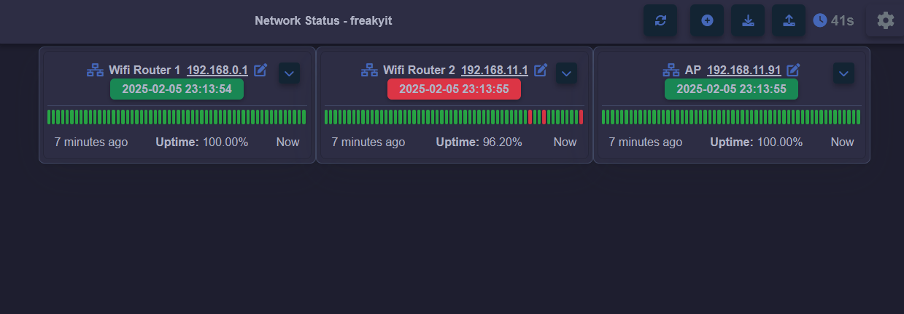
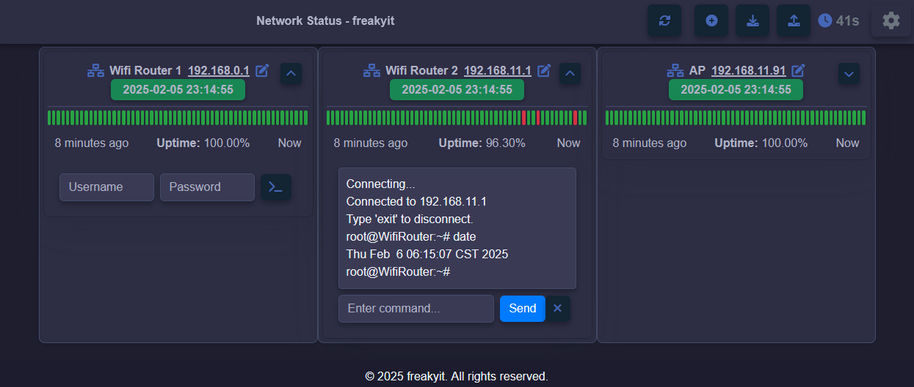

# Network Status Monitoring

This project provides a web-based interface to monitor the status of various network devices. It uses Flask for the backend, Socket.IO for real-time updates, and Bootstrap for the frontend styling.

## Overview



## Features

- **Network Status Monitoring**: View the status of multiple Wi-Fi routers, including whether they're up or down.
- **Real-Time Ping Logs**: Track the ping logs for each router, with timestamps and response times.
- **Dynamic Network Updates**: The app checks and updates network status at a configurable interval, displaying the current status for each router.
- **Configurable Ping Interval**: Set the ping interval dynamically through the web UI (default is 60 seconds).
- **Countdown Timer**: View the remaining time until the next ping update.
- **Subnets Management**: Automatically adds missing subnets to the `network.conf` file using the `route -n` (Linux/macOS) or `route print` (Windows) command to detect network configurations.
- **Scanning Subnets for Devices**: Scans each subnet for active devices and logs the active IPs found during the scan.
- **Stop Scanning**: Ability to stop the subnet scanning process at any time.
- **Logging**: Logs active IPs found during the subnet scan.
- **Telnet Interface**: Connect to network devices via Telnet and execute commands.

## Technologies Used

- **Backend**: Python (Flask, Socket.IO, subprocess)
- **Frontend**: HTML, CSS, JavaScript (Bootstrap, FontAwesome)
- **WebSocket**: `flask-socketio` for real-time communication
- **Telnet**: Python `telnetlib` for Telnet interactions

## Installation

### Using Docker

1. Clone the repository:
    ```sh
    git clone https://github.com/yourusername/netstatus.git
    cd netstatus
    ```

2. Build and run the Docker container:
    ```sh
    docker-compose up --build
    ```

3. Open your web browser and navigate to `http://localhost:5000`.

### Manual Installation

1. Clone the repository:
    ```sh
    git clone https://github.com/yourusername/netstatus.git
    cd netstatus
    ```

2. Create a virtual environment and activate it:
    ```sh
    python3 -m venv venv
    source venv/bin/activate  # On Windows use `venv\Scripts\activate`
    ```

3. Install the required packages:
    ```sh
    pip install -r requirements.txt
    ```

4. Run the application:
    ```sh
    python app.py
    ```

5. Open your web browser and navigate to `http://localhost:5000`.

## Configuration

### Network Configuration

The network devices are configured in the `network.conf` file. This file contains a JSON object with the subnets to be monitored. The application will automatically update this file when new devices are added.

### Changing the Port

#### Manual Installation

To change the port on which the application runs, you can modify the `app.py` file. Locate the following line and change the port number as needed:
```python
if __name__ == "__main__":
    socketio.run(app, host="0.0.0.0", port=5000)
```
Replace `5000` with your desired port number.

#### Docker

To change the port when using Docker, modify the `docker-compose.yml` file. Locate the following line and change the port number as needed:
```yaml
ports:
  - "5000:5000"
```
The format is `host_port:container_port`. Replace the first `5000` with your desired host port number, and the second `5000` with the container port number if needed. Ensure that the `container_port` matches the port specified in `app.py`.

### Themes

The application supports multiple themes:
- Light Theme
- Dark Theme
- Black-Yellow Theme

You can toggle between themes using the "Toggle Theme" button in the web interface.

## Usage

### Adding a New Network Device

1. Click the "Add Network" button.
2. Fill in the network name and IP address.
3. Click "Add Network" to save the new device.

### Renaming a Network Device

1. Click the edit icon next to the device name.
2. Enter the new name and press Enter.

### Viewing Ping Logs

Hover over the ping log bars to view detailed information about each ping, including timestamp, status, response time, and time ago.

### Telnet Support

1. Enter Username/Password and click the Telnet icon button next to the device.
2. Enter commands in the input box and click "Send".
3. The Telnet log box will display the output of the commands.



## Contributing

Contributions are welcome! Please fork the repository and submit a pull request with your changes.

## License

This project is licensed under the MIT License. See the `LICENSE` file for details.
